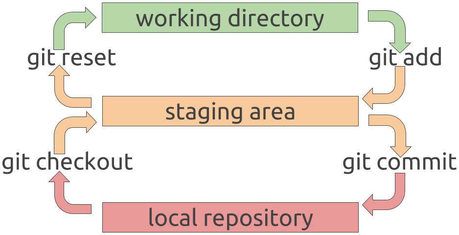
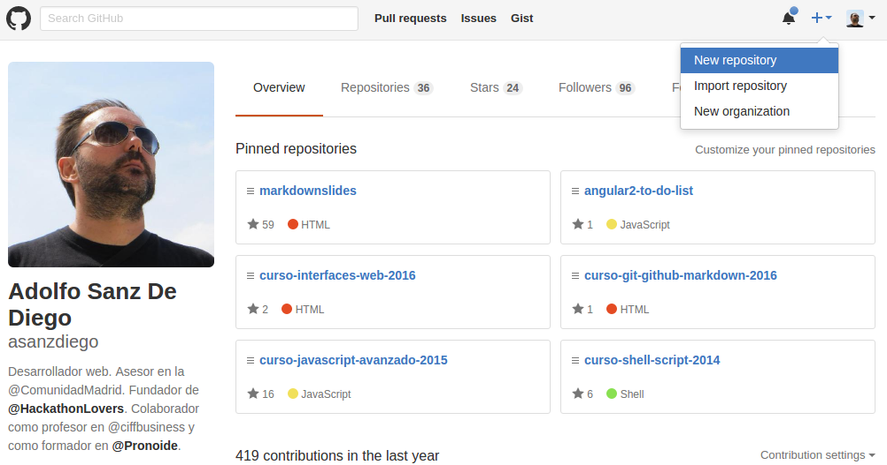
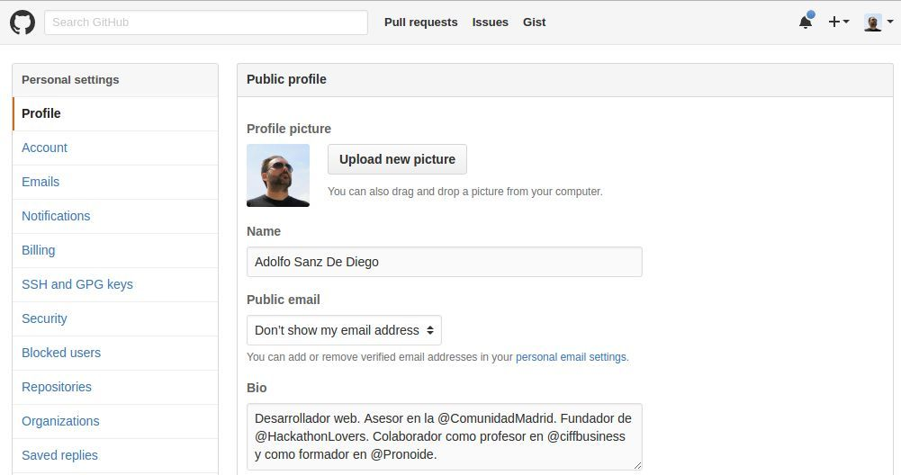
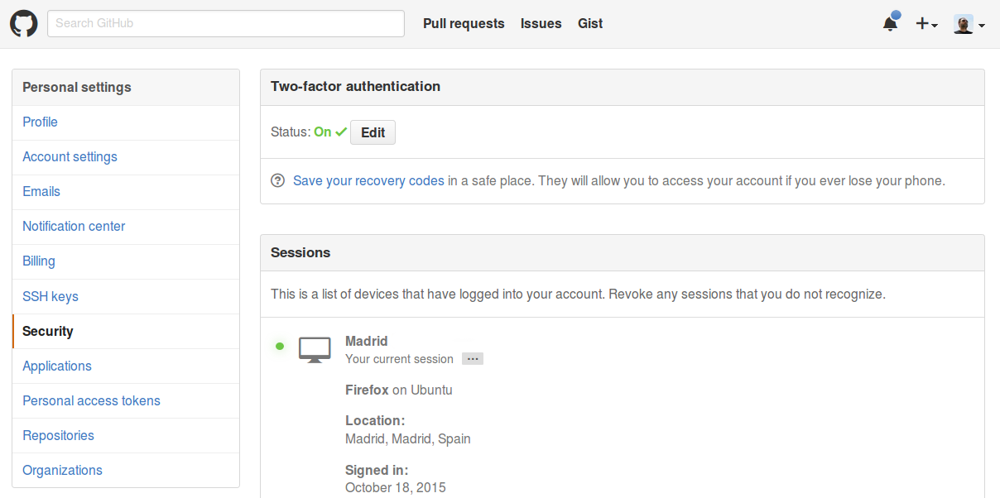
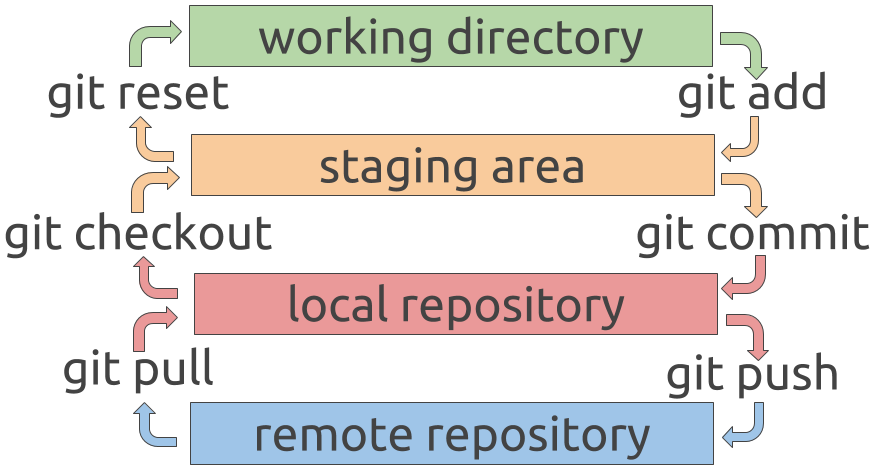
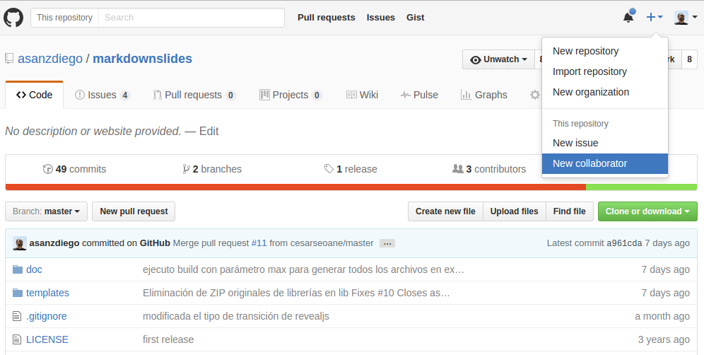
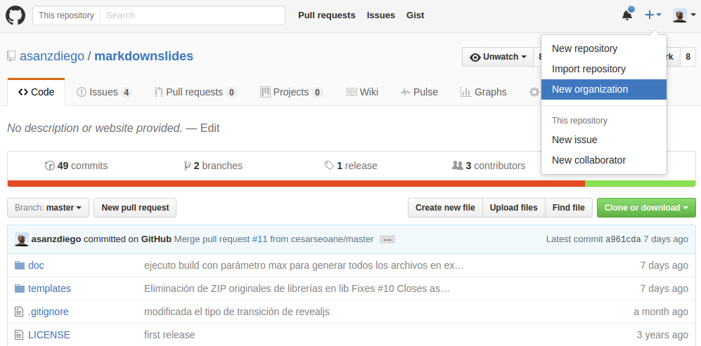

% Git, GitHub y Markdown
% Adolfo Sanz De Diego
% Mayo 2016

# Acerca de

## Autor

- **Adolfo Sanz De Diego**
    - Blog: [asanzdiego.blogspot.com.es](http://asanzdiego.blogspot.com.es/)
    - Correo: [asanzdiego@gmail.com](mailto:asanzdiego@gmail.com)
    - GitHub: [github.com/asanzdiego](http://github.com/asanzdiego)
    - Twitter: [twitter.com/asanzdiego](http://twitter.com/asanzdiego)
    - LinkedIn: [in/asanzdiego](http://www.linkedin.com/in/asanzdiego)
    - SlideShare: [slideshare.net/asanzdiego](http://www.slideshare.net/asanzdiego/)

## Licencia

- **Este obra está bajo una licencia:**
    - [Creative Commons Reconocimiento-CompartirIgual 3.0](http://creativecommons.org/licenses/by-sa/3.0/es/)

## Fuente

- Las slides y sus fuentes las podéis encontrar en:
    - <https://github.com/asanzdiego/curso-git-github-markdown-2016>

# Introducción

## Objetivos

1. Conocer las **características de Git** y ser capaz de instalarlo y configurarlo.
2. Conocer y ser capaz de usar los **comandos de Git**.
3. Conocer las **características de GitHub** y ser capaz de crear una cuenta y configurarla.
4. Ser capaz de **crear y clonar repositorios** en GitHub.
5. Conocer y ser capaz de **usar las principales características de GitHub**.
6. Conocer la **sintaxis del lenguaje Markdown**.

## Indice

- **Bloque 1**
    - Uso básico de Git y GitHub
- **Bloque 2**
    - Uso avanzado de Git y GitHub
- **Bloque 3**
    - Markdown

## Enlaces imprescindibles

- Pro GIT (sobre todo temas 1, 2, 3 y 6):
    - <https://git-scm.com/book/es/v2>

- Página oficial de Git:
    - <https://git-scm.com/>

- Página oficial de GitHub:
    - <https://github.com/>

- Chuleta de la sintaxis de Markdown:
    - <http://warpedvisions.org/projects/markdown-cheat-sheet>

## Otros enlaces de interés

- Aprender GIT... y de camino GitHub:
    - <https://github.com/oslugr/curso-git>

- Minitutorial de GIT:
    - <https://try.github.io/>

- Tutorial de GIT de codecademy;
    - <https://www.codecademy.com/learn/learn-git>

- How GitHub Uses GitHub to Build GitHub:
    - <http://zachholman.com/talk/how-github-uses-github-to-build-github/>

# Uso básico de Git

##  Sistema Control de Versiones

> "Sistema que registra los cambios realizados sobre un archivo o
conjunto de archivos a lo largo del tiempo, de modo que
puedas recuperar versiones específicas más adelante."

- <https://git-scm.com/book/es/v2/Empezando-Acerca-del-control-de-versiones>

## VCS Locales

- **Lo más simple**: hacer copias de directorios.

- Aparecieron **BD en local** que guardan el registro de los cambios realizados a los archivos.

##  VCS Centralizados

- Un **servidor central** que guarda los cambios.

##  Pros y Contras VCS Centralizados

- **Pros**: más colaborativo que el local.

- **Contras**: dependes de un servidor central.

## VCS Distribuidos

- Cada cliente **no solo descarga la última copia, sino todo el repositorio**.

## Ventajes VCS Distribuidos

- Puedes seguir trabajando aunque el repositorio remoto esté caido.
    - **más autonomía**

- La información está más replicada.
    - **menos vulnerable**

- Permite pruebas en local y subir solo lo relevante.
    - **más limpieza**

##  Características de Git

- Creado por **Linux Torvalds**, líder del equipo del kernel Linux.

- Objetivos cuando se creó:
    - **Rápido**
    - **Sencillo**
    - **Multi rama**
    - **Distribuido**
    - **Grandes proyectos**

##  Instalación

- Windows: <https://git-scm.com/download/win>

- Mac: <https://git-scm.com/download/mac>

- Linux: <https://git-scm.com/download/linux>

## Configuración inicial

~~~
git config --global user.name "Nombre que quieras mostrar"
~~~

~~~
git config --global user.email "correo@electronico.es"
~~~

## GUIs

- <https://git-scm.com/downloads/guis>

## Iinicializar un reposiorio

- Crea el **subdirectorio .git** con archivos de git para gestionar el repositorio.

~~~
git init
~~~

## El área de staging

##  Ver el estado de los archivos

- Importante saber el **estado** de los archivos.

~~~
git status
~~~

##  Ver las diferencias

- Podemos ver las **diferencias** entre el área de staging y el área de trabajo.

~~~
git diff
~~~

##  Añadir archivos

- Podemos **añadir** los cambios de un fichero (o varios) al área de staging (desde el área de trabajo).

~~~
git add nombre-del-fichero
~~~

~~~
git add *.extension
~~~

~~~
git add -A
~~~

## Borrar archivos

- Podemos **borrar archivos** del área de staging (también lo borrará del área de trabajo)

~~~
git rm nombre-del-fichero
~~~

## Mover/renombrar archivos

- Podemos **mover/renombrar archivos** en el área de staging (también lo hará en el área de trabajo)

~~~
git mv antiguo-nombre-del-fichero nuevo-nombre-del-fichero
~~~

##  Resetar archivos

- Para **resetear** los cambios de un fichero (o varios) al area de trabajo (desde el area de staging).

~~~
git reset nombre-del-fichero
~~~

##  Grabar los cambios

- Para **grabar** los cambios realizados al repositorio (desde el área de staging).

~~~
git commit -m "mensaje corto descriptivo con los cambios"
~~~

##  Deshacer los cambios

- Para **deshacer** los cambios de un fichero (o varios) al area de staging (desde el repositorio).

~~~
git checkout nombre-del-fichero
~~~

## Listado de cambios

- Para ver el **listado de cambios** realizados en el repositorio.

~~~
git log
~~~

## Alias

- Podemos crear **alias**.

~~~
git config --global alias.list 'log --oneline --decorate --graph --all'
~~~

## Ignorar archivos

- Podemos ignorar archivos añadiendolos al fichero **.gitignore**.

## Creando etiquetas

- Existen etiquetas **ligeras**, y etiquetas **anotadas** (iguales pero estas con más información)

~~~
git tag nombre-etiqueta-lijera
~~~

~~~
git tag -a nombre-etiqueta-anotada -m "mensaje que acompaña a la etiqueta"
~~~

## Etiquetas tardías

- Se puede crear una etiqueta **conociendo el hash del commit** (verlo con git log).

~~~
git tag -a nombre-etiqueta-anotada -m "mensaje que acompaña a la etiqueta" hash-del-commit
~~~

## Ver una etiqueta

- Podemos **ver información concreta de una etiqueta**.

~~~
git show nombre-etiqueta
~~~

## Sacar una etiqueta

- No podemos sacar una etiqueta, pero podemos **colocar en nuestro directorio
de trabajo una versión que coincida con alguna etiqueta, creando una rama nueva**:

~~~
git checkout -b nombre-rama nombre-etiqueta
~~~

# Uso básico de GitHub

##  Características de GitHub

- **Plataforma de desarrollo colaborativo**, que utiliza Git.

- Los **repositorios son públicos**, salvo con cuenta de pago.

- Tiene facetas de **red social** (perfil público, seguidores, estrellas, etc.)

- Nos permite **gestionar organizaciones y equipos**.

- **Gestión de proyectos** (wiki, releases, incidencias, gráficos, etc.)

- **Servidor web**.

##  Crear cuenta

##  Crear repositorio

##  Configurar claves

- Nos permite gestionar repositorios **mediante SSH** sin tener que estar poniendo
siempre nuestra constraseña.

- Se genera una **clave privada** que se guarde en nuestro ordenador y
una **clave pública** que es la que tenemos que guardar en nuestra cuenta.

- La podemos usar pues **solo con un ordenador**.

- Instrucciones:

    - <https://help.github.com/articles/generating-ssh-keys/>

## Cambiar avatar

- View profile and more > Settings > Profile

## Doble factor de autentificación

- View profile and more > Settings > Security

##  Uso social

- Características sociales:
    - Seguir a gente.
    - Seguir proyectos (watch).
    - Premiar proyectos (start).
    - Forquear proyectos (fork).
    - Crear organizaciones.

# Uso avanzado de Git

## Conectar un repositorio remoto

- Podemos **conectar uno o varios reposiorios remotos** a nuestro repositorio.

~~~
git remote add alias-repositorio-remoto url-repositorio-remoto
~~~

## Descargar cambios remotos

- Podemos **descargar los cambios remotos sin modificar nuestro repositorio local**.

~~~
git fetch alias-repositorio-remoto
~~~

## Descargar y combinar

- Podemos **descargar y combinar los cambios remotos** con los de tu repositorio local.

~~~
git pull alias-repositorio-remoto nombre-rama-repositorio-remoto
~~~

## Enviar datos

- Podemos **enviar datos al reposiorio remoto** (solo si está up-to-date).

~~~
git push alias-repositorio-remoto nombre-rama-repositorio-remoto
~~~

- Normalmente:

~~~
git push origin master
~~~

##  Clonar repositorios

- Clonar es como:
    - hacer un init
    - luego un remote add
    - luego un fetch con alias=origin
    - dejando las ramas remota y local en master

~~~
git clone url-repositorio-remoto
~~~

## Resumen áreas

## Crear una rama

- Podemos crear ramas que son **apuntadores que podemos mover por los distintos snapshots**.

- Solo la creamos, no nos situamos en ella.

~~~
git branch nombre-rama
~~~

## Cambiar de rama

- El HEAD es el apuntador que usa GIT para saber en que rama estás.

- Cuando cambiamos de rama GIT **cambia el HEAD y los ficheros de tu área de trabajo**.

~~~
git checkout nombre-rama
~~~

## Crear y cambiar de rama

- Podemos **crear y cambiar de rama** con un mismo comando.

~~~
git checkout -b nombre-rama
~~~

## Ver las ramas y el HEAD

- Podemos **ver las ramas y donde apunta el HEAD**.

~~~
git log --oneline --decorate --graph --all
~~~

~~~
git branch -v
~~~

## Fusionar ramas

- GIT es **muy potente** con la fusión de ramas.

~~~
git merge nombre-rama
~~~

## Solucionar conflictos

- Si al hacer un merge existan conflictos **GIT los apunta en los propios ficheros**.

~~~
<<<<<<< HEAD:index.html

contact : email.support@github.com

=======

please contact us at support@github.com

>>>>>>> issue:index.html
~~~

## Borrar ramas

- Una vez fusionado la rama en el master, **conviene borrarla** (solo nos deja si está fusionada).

~~~
git branch -d nombre-rama
~~~

## Listado de ramas por estado

- Podemos saber **que ramas están fusionada y cuales no**.

~~~
git branch --merged
~~~

~~~
git branch --no-merged
~~~

# Uso avanzado de GitHub

## Añadir colaboradores

- Podemos **dar permisos de push** a quien queramos.

## Crear organizaciones

- Podemos **crear organizaciones**.

## Gestionar organizaciones

- Dentro de las organizaciones podemos **crear equipos** y/o trabajar con colaboradores externos.

- El **nivel de permisos se gestiona a nivel de equipo**.

- Las personas tendrán los permisos de los equipos a los que pertenezca.

- Los permisos se otorgan a cada repositorio.

## Forkear proyectos

- Para **participar en un proyecto sin permisos de escritura**, puedes forkearlo.

- Consiste en crear una copia completa del repositorio bajo tu control:
 se encontrará **en tu cuenta** y podrás escribir en él sin limitaciones.

## Pull-requests

- Para **enviar propuestas de mejora**.

- Se usa mucho para proyectos que no son tuyos y en donde te gustaría colaborar.

- También se usa dentro de equipos para gestionar proyectos grandes.

## Issues y Wikis

- Todos los repositorios de GitHub tienen asociados:
    - un gestor de incidencias (issues)
    - una wiki para documentar

## GitHub pages

- Podemos tener **servidor web en los repositorios simplemente nombrandolos así**:

~~~
usuario.github.io
~~~

~~~
organizacion.github.io
~~~

- También podemos hacer lo mismo con un determinado proyecto **creando una rama gh-pages**.

- Ver : <https://pages.github.com/>

## Fichero README.md

- Nos **lo muestra renderizado** en la página del reposiorio.

# Markdown

##  ¿Qué es Markdown?

> "Es un lenguaje de marcado ligero que trata de conseguir la máxima
legibilidad y 'publicabilidad' usando texto plano."

- <https://es.wikipedia.org/wiki/Markdown>

##  Características principales

- Texto plano
- Sintaxis sencilla
- Legibilidad
- Publicabilidad
- Exportabiliad

## Chuleta de Markdown:

- <http://warpedvisions.org/projects/markdown-cheat-sheet>

##  Editor online

- <https://jbt.github.io/markdown-editor/>

##  Encabezados

- `<h1>, <h2>, <h3>`

~~~
# Encabezado de primer nivel

## Encabezado de segundo nivel

##\# Encabezado de tercer nivel
~~~

- Equivalente a lo anterior.

~~~
Encabezado de primer nivel
==========================

Encabezado de segundo nivel
---------------------------

##\# Encabezado de tercer nivel ##\#
~~~

##  Listas no numeradas

- No enumeradas:
    - se puede usar el menos
    * se puede usar el asterísico
    + se puede usar el más

~~~
- se puede usar el menos
* se puede usar el asterísico
+ se puede usar el más
~~~

##  Listas numeradas

- Enumeradas:
    1. Primer elemento
    1. Segundo elemento
    1. Tercer elemento

~~~
1. Primer elemento
1. Segundo elemento
1. Tercer elemento
~~~

##  Formato (negrita, cursiva, tachado)

- Texto en cursiva con *un asterisco* o con _un guión bajo_.
- Texto en negrita con **dos asteriscos** o con __dos guiones bajos__.
- Texto tachado con ~~dos virgulillas~~.

~~~
- Texto negrita con **dos asteriscos** o con __dos guiones bajos__.
- Texto cursiva con *un asterisco* o con _un guión bajo_.
- Texto tachado con ~~dos virgulillas~~.
~~~

## tablas

| Header | Header | Right  |
| ------ | ------ | -----: |
|  Cell  |  Cell  |   $10  |
|  Cell  |  Cell  |   $20  |

~~~
| Header | Header | Right  |
| ------ | ------ | -----: |
|  Cell  |  Cell  |   $10  |
|  Cell  |  Cell  |   $20  |
~~~

## Citas

> "No hay camino hacia el Software Libre,
el Software Libre es el camino"

~~~
> "No hay camino hacia el Software Libre,
el Software Libre es el camino"
~~~

## Código

~~~R
require(maps) # activación de librería
require(mapproj) # se usará para projection="polyconic"
  # Cargar los datos
  # unemp incluye datos para condados de los Estados Unidos continentales.
data(unemp) # Datos de desempleo
data(county.fips) # mapa de los condados
~~~

~~~
require(maps) # activación de librería
require(mapproj) # se usará para projection="polyconic"
  # Cargar los datos
  # unemp incluye datos para condados de los Estados Unidos continentales.
data(unemp) # Datos de desempleo
data(county.fips) # mapa de los condados
~~~

## Enlaces

- [Enlace con texto](https://github.com/asanzdiego/curso-git-github-markdown-2015)

- Enlace sencillo:
    -<https://github.com/asanzdiego/curso-git-github-markdown-2015>

~~~
- [Enlace con texto](https://github.com/asanzdiego/curso-git-github-markdown-2015)

- Enlace sencillo:
    -<https://github.com/asanzdiego/curso-git-github-markdown-2015>
~~~

## Imágenes

- Este obra está bajo una licencia:

~~~
- Este obra está bajo una licencia:

~~~
